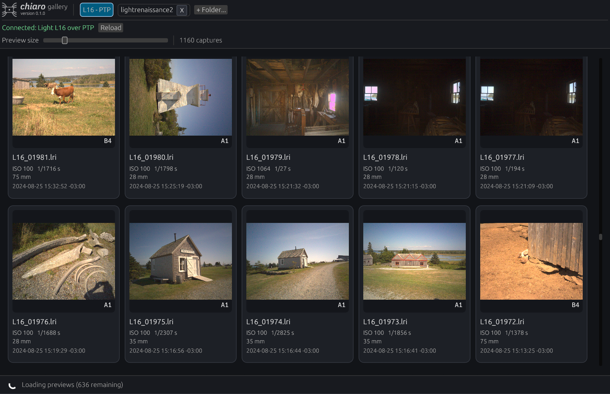

# Chiaro Gallery

Chiaro Gallery is a native Linux application for browsing and processing Light
L16 captures from local folders or a connected camera over PTP/MTP.



## Installation

Download a prebuilt archive from [GitHub
Releases](https://github.com/shinf1x/chiaro/releases), install with Cargo, or
run the workspace package directly:

```bash
cargo install --git https://github.com/shinf1x/chiaro.git chiaro-gallery
cargo run -p chiaro-gallery --release
```

## Browsing captures

Connected Light L16 cameras appear automatically. Local folders can be opened
with **+ Folder...** or by dropping a folder or LRI file onto the application.
Folder scans are non-recursive.

Each capture card shows its main metadata and framed preview. Opening a card
shows every camera module and, when present, every frame of a repeated
night-mode capture. Full-resolution module previews support pan and zoom.
Damaged or unsupported captures remain visible as error cards.

Decoded previews are cached in the platform cache directory. The **Settings**
tab controls whether caching is enabled, its size limit, and cache clearing.
Persistent settings are stored in the platform configuration directory as
`chiaro/gallery.json`.

An inspectable `gallery.sqlite3` database beside `gallery.json` indexes capture
identity hashes, source and thumbnail paths, and successful exports. Thumbnail
files are split across two hash-prefix directory levels so large collections do
not put thousands of files in one directory.

## Exporting

Select cards with their checkbox or non-image area; Shift-click extends the
current selection range. Starting an export clears the selection. Additional
exports can be added while another job is running and are processed in order.
Cards that have been exported successfully show a teal check in their
upper-right corner; the state persists through `gallery.sqlite3`.

Available pipelines:

- **Hot-pixel corrected frames** writes linear 16-bit PNGs into one directory
  per physical camera. It uses the same correction pipeline as
  [`chiaro-hotpixel`](../hotpixel/README.md).
- **Fused high-resolution frame** aligns the participating modules and writes
  one 16-bit PNG plus a `.fusion.json` diagnostic report per capture. It uses
  the same pipeline as [`chiaro-fuse`](../fuse/README.md).

Exports report progress, can be cancelled, check available disk space, and
record failures in `export-log.txt`. Night-mode captures are not currently
accepted by either export pipeline; use the Hotpixel CLI for per-camera
night-frame extraction.

### Camera calibration

When a camera is indexed, Gallery looks for these device-specific files in
`DCIM/Camera/lightcal`:

- `hotpixel.rec`
- `calibration.lri`
- `zoom_calib_v0.lri`

They are copied to a local cache when first needed. Manually selected paths are
not overwritten.

Use the `hotpixel.rec` belonging to the same physical camera. The geometric
calibration files are also strongly recommended: capture headers contain only
part of the camera model, and cross-module alignment is likely to be poor
without the remaining geometry and mirror-aiming data.

## Important limitations

- Fusion uses one refined homography per module and is intended for distant
  scenes. Near subjects can ghost because depth-dependent parallax is not yet
  modelled.
- Disconnecting USB during an active PTP operation can leave some L16 cameras
  unresponsive. Recovery may require holding the camera power button for about
  30 seconds.
