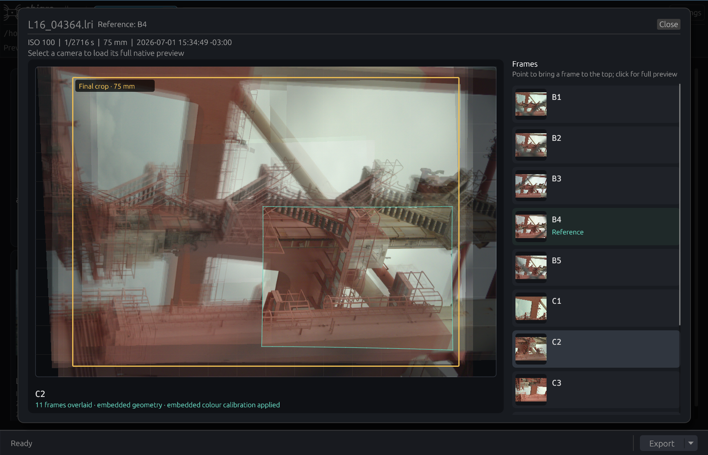

# Chiaro Gallery

Chiaro Gallery is a native Linux application for browsing and processing Light
L16 captures from local folders or a connected camera over PTP/MTP.


## Installation

Download a prebuilt archive from [GitHub
Releases](https://github.com/shinf1x/chiaro/releases), install with Cargo, or
run the workspace package directly:

```bash
cargo install --git https://github.com/shinf1x/chiaro.git chiaro-gallery
cargo run -p chiaro-gallery --release
```

## Browsing captures

Connected Light L16 cameras appear automatically. Local folders can be opened
with **+ Folder...** or by dropping a folder or LRI file onto the application.
Folder scans are non-recursive.

Each capture card shows its main metadata and framed preview. Opening a card
shows all calibrated camera frames together on one translucent composite
canvas. Embedded camera intrinsics, distortion, and module pose remap usable
frames into the reference view; modules whose embedded geometry is incomplete
fall back to focal-group scaling. Pointing at a frame in the list on the right
draws that layer last without hiding the other frames; clicking either the list
entry or canvas opens the existing full-resolution pan-and-zoom preview for
that frame. A gold outline marks the final crop recorded by the camera, relative
to the reference focal group. Colour previews use the calibration matrix and
white balance embedded in the LRI. The traditional grid remains available by
turning off **Show a combined calibrated frame overlay** in Settings. Damaged
or unsupported captures remain visible as error cards.



Decoded previews are cached in the platform cache directory. The **Settings**
tab controls whether caching is enabled, its size limit, and cache clearing.
Persistent settings are stored in the platform configuration directory as
`chiaro/gallery.json`.

An inspectable `gallery.sqlite3` database beside `gallery.json` indexes capture
identity hashes, source and thumbnail paths, and successful exports. Thumbnail
files are split across two hash-prefix directory levels so large collections do
not put thousands of files in one directory.

## Exporting

Select cards with their checkbox or non-image area; Shift-click extends the
current selection range. Starting an export clears the selection. Additional
exports can be added while another job is running and are processed in order.
Cards that have been exported successfully show a muted bronze output icon
beside their filename; the state persists through `gallery.sqlite3`.

Available pipelines:

- **Hot-pixel corrected frames** writes linear 16-bit PNGs into one directory
  per physical camera. It uses the same correction pipeline as
  [`chiaro-hotpixel`](../hotpixel/README.md).
- **Fused high-resolution frame** aligns the participating modules and writes
  one 16-bit PNG plus a `.fusion.json` diagnostic report per capture. It uses
  the same pipeline as [`chiaro-fuse`](../fuse/README.md).

Exports report progress, can be cancelled, check available disk space, and
record failures in `export-log.txt`. Night-mode captures are not currently
accepted by either Gallery export pipeline; use
[`chiaro-stack`](../stack/README.md) for gyro-seeded temporal denoising and
calibrated multi-camera night fusion.

### Camera calibration

When a camera is indexed, Gallery looks for these device-specific files in
`DCIM/Camera/lightcal`:

- `hotpixel.rec`
- `calibration.lri`
- `zoom_calib_v0.lri`

They are copied automatically to the platform cache when a camera is first
indexed. Gallery matches the calibration files to captures by the physical
camera's 128-bit device id and uses the completed geometry for the combined
preview and export defaults. Calibration from a different camera is ignored;
manually selected paths are not overwritten.

Use the `hotpixel.rec` belonging to the same physical camera. The geometric
calibration files are also strongly recommended: capture headers contain only
part of the camera model, and cross-module alignment is likely to be poor
without the remaining geometry and mirror-aiming data.

## Important limitations

- Fusion uses one refined homography per module and is intended for distant
  scenes. Near subjects can ghost because depth-dependent parallax is not yet
  modelled.
- Disconnecting USB during an active PTP operation can leave some L16 cameras
  unresponsive. Recovery may require holding the camera power button for about
  30 seconds.
